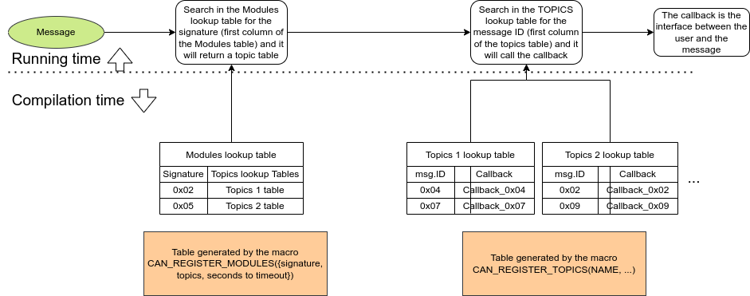

# CAN_PARSER
Generic can parser lib

## About
This is a basic parser for Zenite Solar Can Bus messages that automatically converts raw messages to a struct generated by the CAN_IDS generator, which can be found on the [CAN_IDS](https://github.com/ZeniteSolar/CAN_IDS) GitHub page. The Zenite Solar Can Bus protocol uses the built-in message ID of the CanBus protocol to distinguish messages, and each PCB board (which we refer to as a module) has a unique signature. The module's signature is sent in the first byte of the payload, allowing for easy identification of the module. In addition, the second byte of the payload is generally reserved for indicating the status of the PCB.

Example of a Zenite Solar CanBus Data Frame:

| Byte | Meaning   |
|------|-----------|
| 0    | Signature |
| 1    | Status    |
| 2**  |           |
| 3**  |           |
| 4**  |           |
| 5**  |           |
| 6**  |           |
| 7**  |           |

\*\* Those byte are optional 

**Visual example of the parser**



## How to use
An example of how to use the parser can be found in the [tests/simpletest.c](tests/simpletest.c) file. This simple test provides an illustration of how the parser can be used to convert a motor raw message to a struct generated by the CAN_IDS generator and print it in the stdout.
And a more complex example is in the [tests/bigtest.c](tests/bigtest.c) file.


1. To add this library to your makefile:
    - Compile the library using the make command.
    - Add the -L*path_to_the_bin_of_the_project* compiler flag and the -lcan_parser flag.
2.    Define a parser callback function for each message with the following prototype: `static void *function_name*(can_msg_t *msg);` Example:
```C
static void parse_mic_motor(can_msg_t *msg)
{
    can_mic19_motor_msg_t *mic_motor = (can_mic19_motor_msg_t *)msg->raw;

    printf("mic motor signature: %d\n", mic_motor->signature);
    printf("mic motor motor on: %d\n", mic_motor->motor.motor_on);
    printf("mic motor dms on: %d\n", mic_motor->motor.dms_on);
    printf("mic motor reverse: %d\n", mic_motor->motor.reverse);
    printf("mic motor d: %d\n", mic_motor->d);
    printf("mic motor i: %d\n", mic_motor->i);
}
```
3. Create a table of topics that links each topic to its corresponding callback function using the CAN_REGISTER_TOPICS macro.
    for example if you need the message to the motor(MAM) sent by the user interface(MIC) and the status message of the MIC
```C
CAN_REGISTER_TOPICS(mic,
                    {CAN_MSG_MIC19_STATE_ID, &parse_mic_state},
                    {CAN_MSG_MIC19_MOTOR_ID, &parse_mic_motor});
```
this code will generate a topic with the name *mic* with two messages IDs *CAN_MSG_MIC19_STATE_ID* and *CAN_MSG_MIC19_MOTOR_ID* that will call the parse_mic_state and parse_mic_motor callback function (Declared in the topic 1) respectively.

4. Create a table of modules that links each module's signature to its table of topics.
    for example if the group of topics are for the signature of the MIC module:
```C
    CAN_REGISTER_MODULES(mam_rx, 1, {CAN_SIGNATURE_MIC19, &CAN_TOPICS_NAME(mic), 100},
                        {CAN_SIGNATURE_MSWI19, &CAN_TOPICS_NAME(mswi), 100});
```
this code will generate a parser table, that have two signatures *CAN_SIGNATURE_MIC19* and *CAN_SIGNATURE_MSWI19* and they are linked with the tables generated by the CAN_REGISTER_TOPICS macro.

5. If you want to receive an event when a module goes X amount of time without sending messages, you need to use the can_update_timeout() function and specify the desired timeout value when registering the module. This function should be called at a fixed frequency, which needs to be specified when registering the module.
```C
CAN_REGISTER_MODULES(mam_rx, **frequency**, 
                        {CAN_SIGNATURE_MIC19, &CAN_TOPICS_NAME(mic), 100},
                        {CAN_SIGNATURE_MSWI19, &CAN_TOPICS_NAME(mswi), 100});
```
And the time in seconds that it will call the timeout event for each topic is specified here:
```C
CAN_REGISTER_MODULES(mam_rx, **frequency**, 
                        {CAN_SIGNATURE_MIC19, &CAN_TOPICS_NAME(mic), **Time in seconds**},
                        {CAN_SIGNATURE_MSWI19, &CAN_TOPICS_NAME(mswi), **Time in seconds**});
```

6. Run the parser, passing the modules table and the message, Example:
    ```C
    can_parser(&CAN_PARSER_NAME(mam_rx), &msg);
    ```
    and example of the can_update_timeout() function:
    ```C
    can_update_timeout(&CAN_PARSER_NAME(mam_rx));
    ```


